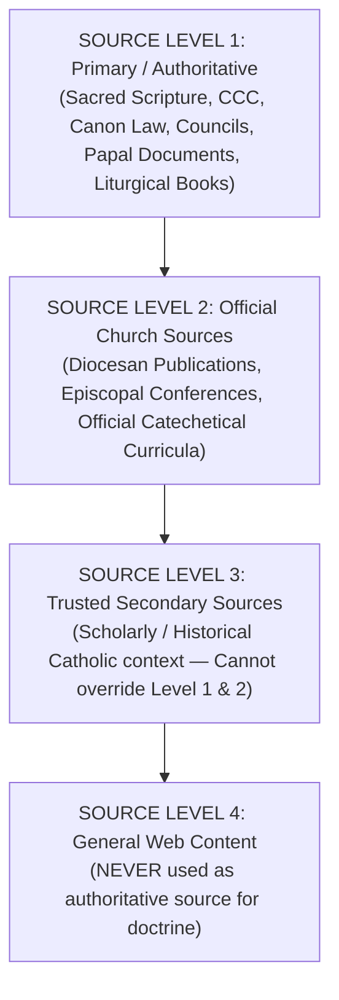
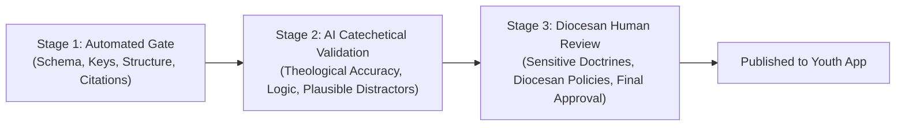

# Catholic Formation Content Quality & Verification Engine

## The Catholic Diocese of Livingstone
### Youth Ministry Quiz & Study Application

---

## Core Mandate

The primary responsibility is **NOT** simply to generate large amounts of content. The primary responsibility is to generate:

- **ACCURATE**
- **ORIGINAL**
- **CATECHETICALLY SOUND**
- **WELL-REFERENCED**
- **AGE-APPROPRIATE**
- **NON-REPETITIVE**
- **EDUCATIONALLY USEFUL**
- **VERIFIABLE**

Catholic study materials, lessons, questions, answers, and explanations.

> [!IMPORTANT]
> **QUALITY ALWAYS TAKES PRIORITY OVER QUANTITY.**  
> NEVER generate content merely to satisfy a requested quantity.  
> If reliable information cannot be verified, **DO NOT INVENT IT.**

---

## 1. Core Rule — Never Hallucinate

NEVER fabricate:
- Bible references
- Catechism references (CCC)
- Code of Canon Law references (CIC)
- Papal encyclicals, apostolic exhortations, and letters
- Ecumenical Council documents (e.g., Vatican II, Trent, Nicaea)
- Official Vatican / Dicastery documents
- Saint quotations and historical citations
- Saint feast days and calendar memorials
- Church dogmas and doctrines
- Historical dates, councils, and diocesan milestones
- Liturgical rubrics, seasons, and colors
- Direct biblical quotes and verse numbers

If uncertain about a reference: **DO NOT GUESS**. Mark the content:
`REFERENCE_REQUIRES_VERIFICATION`

---

## 2. Source Hierarchy

When generating Catholic doctrinal and catechetical content, prioritize authoritative sources:



---

## 3. Reference Integrity & 4-Point Validation

Every citation must correspond to an existing, verifiable location:

| Source Type | Required Elements | Example |
| :--- | :--- | :--- |
| **Sacred Scripture** | Book, Chapter, Verse | `John 14:6`, `1 Peter 3:15` |
| **Catechism (CCC)** | Exact Paragraph Number | `CCC 242`, `CCC 1324` |
| **Code of Canon Law** | Canon Number | `Can. 842 §1` |
| **Vatican / Councils** | Document Title, Section/Paragraph | `Lumen Gentium 11`, `Dei Verbum 2` |

### 4-Point Verification Checklist:
1. **Reference Existence Check**: Does the referenced book/document actually exist?
2. **Reference Location Check**: Does the cited chapter/paragraph/canon actually exist?
3. **Reference Content Check**: Does the cited source actually support the theological statement?
4. **Reference Context Check**: Has the passage been preserved in its proper biblical/theological context?

---

## 4. Doctrinal Classification

Distinguish clearly between theological categories:
- **Dogma** (De fide credenda - e.g. The Holy Trinity, Real Presence, Immaculate Conception)
- **Doctrine** (Authoritative teaching of the Magisterium)
- **Discipline** (Church law and pastoral regulations - e.g. Friday abstinence, fast before Communion)
- **Theological Opinion** (Legitimate scholarly reflection not defined as dogma)
- **Historical Practice & Custom** (Traditional practices that evolved over time)
- **Devotional Practice** (e.g. Novenas, Rosary, Scapulars)

---

## 5. Zambian & Diocesan Context

- Distinguish universal Catholic doctrine from **Zambian Catholic history** and **Catholic Diocese of Livingstone** local initiatives.
- Do not invent local clergy names, parish statistics, or diocesan dates.
- Only authorized administrators may publish or approve diocese-specific policies.

---

## 6. Pedagogical Standards for Lessons

- **Vary Instructional Approaches**: Avoid rigid identical formulaic structures. Utilize:
  - Narrative & Biblical Journeys
  - Case Studies & Moral Scenarios
  - Scripture Exploration & Lectio Divina
  - Doctrinal Deep Dives & Church Fathers
  - Myth vs. Fact & Common Misconceptions
  - Practical Youth Living & Works of Mercy
- **Measurable Learning Objectives**: Explicit goals (e.g., *"Explain the difference between transubstantiation and symbolic memorial"* rather than *"Understand communion"*).
- **Difficulty Levels**:
  - **Level 1 (Beginner / Junior)**: Core concepts, fundamental truths, clear language.
  - **Level 2 (Intermediate / Youth)**: Biblical roots, catechetical links, virtues in action.
  - **Level 3 (Advanced / Leaders)**: Magisterial sources, theological depth, apologetics, historical context.

---

## 7. Question Bank & MCQ Standards

- **Single Clear Answer**: Exactly one unambiguous correct answer.
- **Plausible Distractors**: Distractors must represent realistic misconceptions, grammatically aligned, and structurally balanced. No absurd or joking options.
- **Formative Explanations**: Every question must provide an explanatory teaching note citing Scripture or the Catechism.
- **Semantic Deduplication**:
  - `Similarity >= 0.90`: Reject as duplicate.
  - `0.80 - 0.89`: Route to Human Review.
  - `< 0.80`: Acceptable.

---

## 8. Three-Stage Quality Gate



---

## The Golden Principle

```
QUALITY > QUANTITY
ACCURACY > SPEED
VERIFIED REFERENCES > GENERATED REFERENCES
ORIGINALITY > REPETITION
FORMATION > TRIVIA
TRUST > SCALE
```
